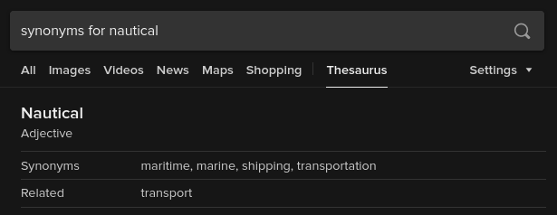

# Maritime
Welcome to maritime! This is the new, experimental low level control stack
for the AVBotz submarine, Nemo. Once completed, it will replace Nautical in
driving the sub. Connect PC to nucleo f767zi microcontroller via usb to begin.

## Install

In a terminal, enter the following commands:
```sh
git clone --recurse-submodules https://github.com/avbotz/maritime.git
cd maritime
./install.sh
```

## Compiling

```sh
./compile.sh (local compile)
west flash   (flashes microcontroller)
./comms.sh   (init serial communication)
```

## Startup

After building and flashing, run tmux in a terminal. Split the tmux window into two panes. Run "cat < /dev/ttyACM*" in one and "cat > /dev/ttyACM*" in the other. The former pane is the DISPLAY pane, it will show the output from maritime. The latter is the COMMAND pane, it is where maritime receives its input.

## Commands

(Check "src/main.c" for full list of commands.)
```
+---------------------+----------------------+-------------------+
|        Input        |     Description      |      Output       |
+---------------------+----------------------+-------------------+
| a                   | Kill switch (1=on).  | %i                |
| c                   | Sub location.        | %f %f %f %f %f %f |
| d                   | Sub destination.     | %f %f %f %f %f %f |
| p %f                | Set power (0-1).     | N/A               |
| s %f %f %f %f %f %f | Set destination.     | N/A               |
| r %f %f %f %f %f %f | Add relative state.  | N/A               |
| h                   | Raw heading (0-360). | N/A               |
| x                   | Reset all states.    | N/A               |
+---------------------+----------------------+-------------------+
```
Each 6 %f's represent a state, or sub position. The order of the numbers is
X, Y, Z, Yaw, Pitch, Roll. This is relative to a North-East-Down coordinate
frame.

## What's the name?


## Why maritime?
Maritime was designed from the ground up to solve many deficiencies with the current
Nautical system. These include:
* Limited computing power on the Atmega 2560 (clock, flash/ram, no FPU)
* Constrained to AVR devices only
* No threading capabilities
* Lack of a robust communication protocol between nautical and a PC
* Lack of robust sensor filtering and estimation
* Lack of robust attitude and velocity control in 6 DoF

Maritime addresses the above deficiences as well as makes further improvements:
* Switched hardware from Arduino Mega2560 to STM32G4/G0/H7 based boards
* Uses Zephyr RTOS (for hardware abstraction as well as multithreading)
* MAVLink communication protocol between maritime and the PC
* Improved sensor filtering and state estimation (Kalman filter planned)
* 6 DoF control
* Cascaded P/PID control architecture.
* (Hopefully) better simulation capabilities
* Runtime parameter configuration
* Distributed across multiple MCUs that each handle a certain part of the stack (motor control, estimation/AHRS, DVL)
* Dual CAN-FD for robust and redudant bus communication between the MCUs
* Additional improvements are planned. Stay tuned!
