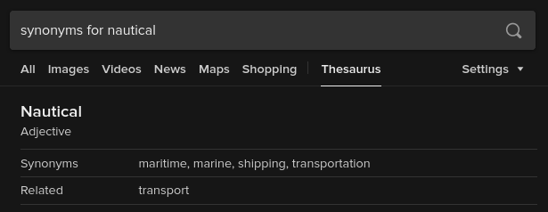

# Maritime
Welcome to maritime! This is the new low-level stack that runs on the microcontroller. Maritime interfaces with servos, thrusters, and some sensors and communications with the high-level codebase, thalassic, over USB.

## Install

In a terminal, enter the following commands:
```sh
git clone --recurse-submodules https://github.com/avbotz/maritime.git
cd maritime
git switch pico
./install.sh
```

## Compiling

```sh
source ./setup.sh   (init terminal)
west build -b BOARD (local compile)
./comms.sh          (init serial communication)
west flash -r uf2   (flashes microcontroller)
```

Debugging build:
```sh
west build -b BOARD -- -DEXTRA_CONF_FILE=debug.conf
```

For the Raspberry Pi Pico target, use:

```sh
west build -b rpi_pico
west flash -r uf2
```

## Startup

After building and flashing, run tmux in a terminal. Split the tmux window into two panes. Run "cat < /dev/ttyACM*" in one and "cat > /dev/ttyACM*" in the other. The former pane is the DISPLAY pane, it will show the output from maritime. The latter is the COMMAND pane, it is where maritime receives its input.

You may also use screen, microcom, picocom, or any other software terminal emulator to interact with maritime, though your mileage may vary.

## Commands

The Pico branch supports the text protocol expected by thalassic's `sub_low` driver:

Send from high-level to maritime:
```
p <thruster_id> <thrust>  Set one thruster, where thrust is clamped to [-1, 1].
a <thrust>                Set all 8 thrusters to the same clamped thrust.
```

Send from maritime to high-level:
```
x <killed>                Published at 10 Hz; 1 means killed, 0 means alive.
d <depth>                 Published at 10 Hz; depth in meters.
```

The Raspberry Pi Pico overlay maps thrusters to GP0-GP7, the kill switch to GP28, and pressure ADC input to GP26. Torpedoes, droppers, and pressure sensors are not implemented in this branch yet.

## Internal Workings

Maritime currently communicates with the high-level stack via USB CDC-ACM, which effectively exposes a serial interface to the computer over usb (COM ports on windows, /dev/ttyACM on Linux). Currently, the codebase communicates via commands delinated by newlines, though this may change in the future (MAVLink?).

## What's the name?


## Why maritime?
Maritime was designed from the ground up to solve many deficiencies with the current
Nautical system. These include:
* Limited computing power on the Atmega 2560 (clock, flash/ram, no FPU)
* Constrained to AVR devices only
* No threading capabilities
* Lack of a robust communication protocol between microcontroller and PC

Maritime addresses the above deficiences as well as makes further improvements:
* Switched hardware from Arduino Mega2560 to RP2040 based boards
* Uses Zephyr RTOS (for hardware abstraction as well as multithreading)
Planned:
* MAVLink communication protocol between maritime and the PC
* Migration to Flipsky ESCS and CAN-FD for communication
